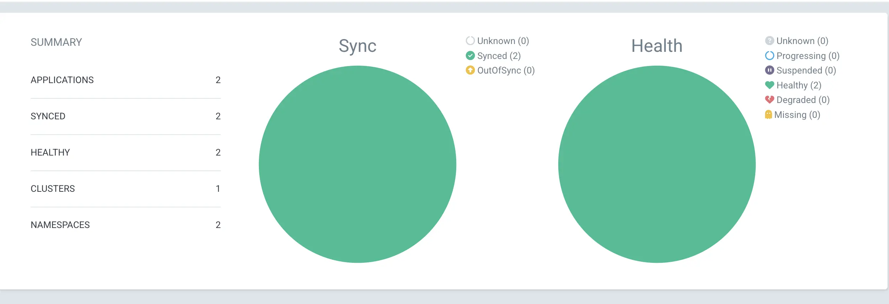
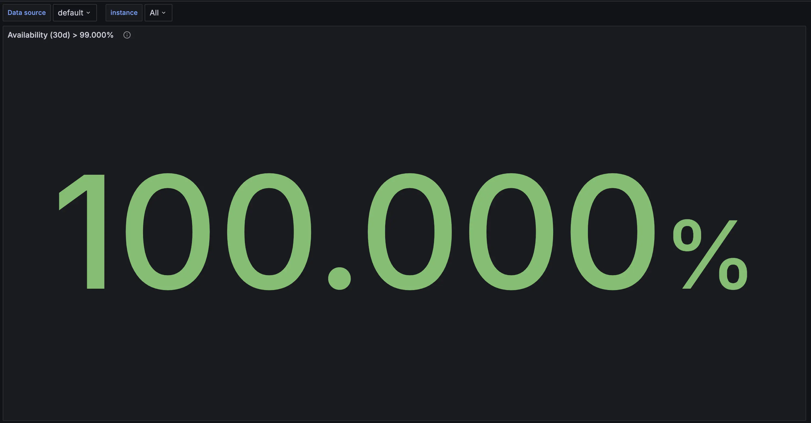

In this guide, I'll walk you through setting up a powerful personal cloud environment on Oracle's Always Free Tier using Kubernetes. This setup leverages open-source tools like MetalLB, Nginx Ingress, Prometheus, Grafana, and more to create a flexible and scalable infrastructure.

## Overview

Setting up your own cloud infrastructure can significantly simplify deployment processes. With Kubernetes managing containerized applications, you can deploy updates and new services with ease. Once set up, deploying a new application requires only a Docker image, and it will be live in minutes.

### Tools Used

- **Kubernetes (K8s)**: Orchestrates containerized applications.
- **MetalLB**: Provides load balancing for bare metal Kubernetes clusters.
- **Nginx Ingress**: Manages external access to services within the cluster.
- **Cert-Manager**: Automates SSL certificate management with Cloudflare DNS.
- **ArgoCD**: Automates continuous deployment of applications.
- **Prometheus**: Collects metrics from Kubernetes and applications.
- **Grafana**: Visualizes Prometheus metrics with dashboards.
- **Velero**: Backs up and restores Kubernetes resources.


### Initial Setup

To begin, initialize a Kubernetes cluster using `kubeadm` on Oracle's Ampere instance. Configure networking with Calico for network policies and security.
```bash
sudo kubeadm init phase certs all --apiserver-advertise-address=0.0.0.0 --apiserver-cert-extra-sans=10.96.0.1,10.0.0.144,129.154.255.75
```
I've allowed multiple IPs address for which kube API server certificate would be valid for.

### MetalLB Configuration

MetalLB assigns the machine's public IP for load balancing across services. Ensure correct layer2 configuration for your setup.

### Nginx Ingress for External Access

Set up Nginx Ingress to manage traffic from wildcard subdomains routed through Cloudflare for CDN and SSL termination. Each application is deployed on its subdomain, such as `https://typeahead-rs.0xamit.com/`.

```yaml  showLineNumbers {9} caption="Example snippet from Helm values.yaml for typeahead-rs application"
ingress:
  enabled: true
  className: "nginx"
  annotations: 
    cert-manager.io/cluster-issuer: letsencrypt-issuer
    nginx.ingress.kubernetes.io/ssl-redirect: "true"
  hosts:
    - host: typeahead-rs.0xamit.com
      paths:
        - path: /
          pathType: ImplementationSpecific
  tls:
    - secretName: 0xamit-com-tls
      hosts:
      - typeahead-rs.0xamit.com
```

### Continuous Deployment with ArgoCD

ArgoCD automates application deployments. Simply create a Helm application in your infrastructure repository and add it to ArgoCD. GitHub Actions handles CI, updating Helm repositories with new Docker images.


### Monitoring and Observability

Monitor cluster health with Prometheus and visualize metrics in Grafana dashboards. This ensures proactive management of resources and application performance.


Currently cluster availability is determined by the uptime SLA of oracle instance.

### Backups with Velero

Protect your Kubernetes setup with Velero. Regularly back up cluster resources to prevent data loss and streamline disaster recovery.

### Future Steps
#### Stateful Services Deployment
Explore deploying stateful applications across multiple nodes other than [Local PV](https://kubernetes.io/blog/2019/04/04/kubernetes-1.14-local-persistent-volumes-ga/).

#### High Availability (HA) Considerations
Plan for multi-master Kubernetes clusters to mitigate single-point-of-failure risks and improve overall system reliability.
There are multiple cloud vendor that provides bare metal servers at reasonable price.

### Conclusion
Setting up your personal cloud on Oracle's Always Free Tier empowers you to deploy and manage applications efficiently. With Kubernetes and robust tooling, you can scale your infrastructure as needed and ensure secure, reliable service delivery.


### For further details, explore:
- [My Infra repository](https://github.com/AimAmit/infra)
- [Medium article](https://medium.com/kubernetes-deveops/installing-kubernetes-kubeadm-part-1-e146cb632163)
- [Oracle firewall changes](https://stackoverflow.com/a/54810101/8194317)
- [Calico setup](https://www.golinuxcloud.com/calico-kubernetes/)

Feel empowered to build and innovate with your personal cloud setup!

